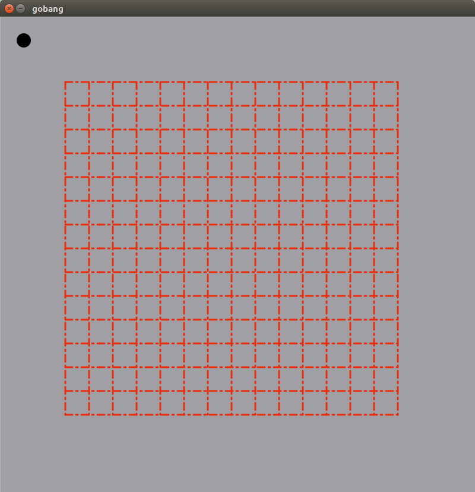
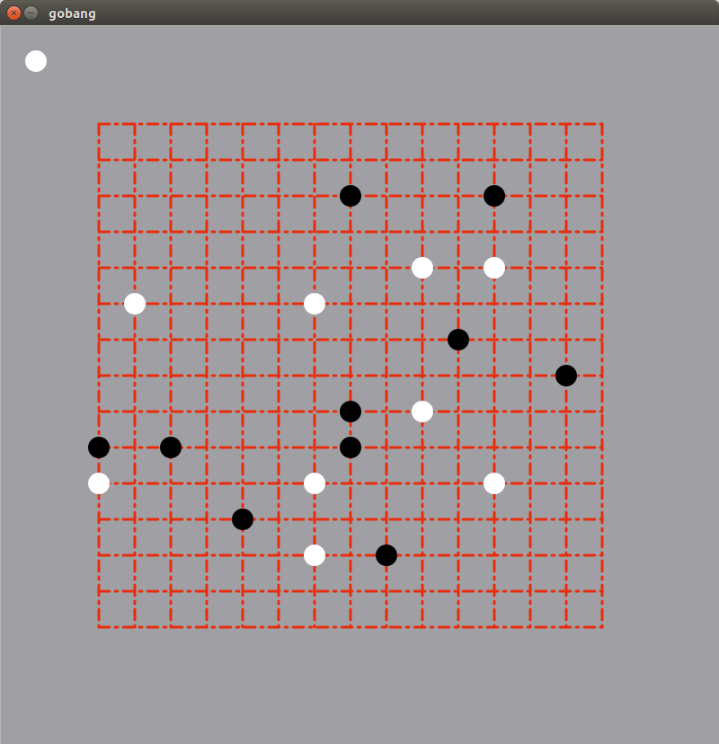
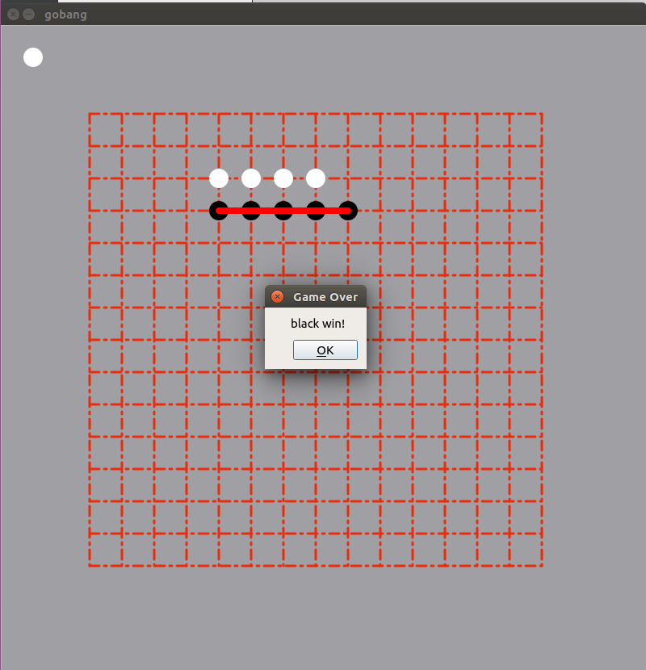

<h1 style="text-align:center"> Linux实验报告:用Qt编写五子棋 </h1>

杨庆龙

2017.8.8

## 实验环境
Ubuntu17.04(Linux-4.9.10-19-generic)
## 实验要求
<ul>
<li>用Qt写编写一个用于对战的五子棋游戏</li>
<li>具有重置功能</li>
<li>当满足胜利条件时，能够自动停止游戏，并将符合条件的棋子标记出来</li>
</ul>

## 实验内容
考虑主要使用QGraphicsScene和QGraphicsView进行图形绘制，再使用MousePressEvent函数得到用户点击的位置，进行相应的计算。
### 头文件说明
<ul>
<li>constant.h: 里面存放了例如棋子大小，棋盘大小等常量，便于调整。</li>
<li>mainwindow.h: 继承自QMainWindow，主要功能为获取用户点击的位置，并将相应的指令交给five类和myscene类。</li>
<li>myscene.h: 继承自QGraphicsScene，主要功能是作为QGraphicsItem子类进行绘制的平台。同时，在其内部维护了一个15*15的棋盘，用于储存相应位置棋子的指针，实现绘制棋子功能的封装，避免绘制错位的问题发生。</li>
<li>piece.h: 继承自QGraphicsItem，主要功能为给定位置和颜色，在myscene中的相应位置绘制一个黑或白的棋子。</li>
<li>winline.h: 继承自QGraphicsItem，主要功能为给定最终符合胜利条件的棋子的首尾位置，绘制一条红色的线。</li>
<li>table.h: 继承自QGraphicsItem，主要功能为绘制棋盘。</li>
<li>five.h:一个在后台进行局势记录的类，当mainwindow向myscene中添加棋子时，也同步向five中添加棋子，并使用five中的方法检测棋局是否已经结束。</li>
</ul>

## 实验结果
得到一个如图所示的界面
点击网格的交叉处可以在相应位置落下棋子，如果点击位置离网格太远，则不会有棋子落下
点击左上角的按钮可以重置棋局，同时，该按钮的颜色还代表了当前的执棋方
当其中一方满足胜利条件时，便会有如图所示的提示信息弹出，并在棋局中标明满足条件的棋子的位置
## 遇到的问题
<ul>
<li>在QGraphicsScene中使用clear函数后，实例会将元素指针所指内容删除，这时再在外部对指针进行操作就会导致程序崩溃。</li>
<li>将元素添加到QGraphicsScene后，如要对元素的内容进行更改，就要将元素先从Scene中remove出来，进行更改后再插入Scene。若直接通过指针对元素内容进行更改，会导致程序崩溃</li>
</ul>
