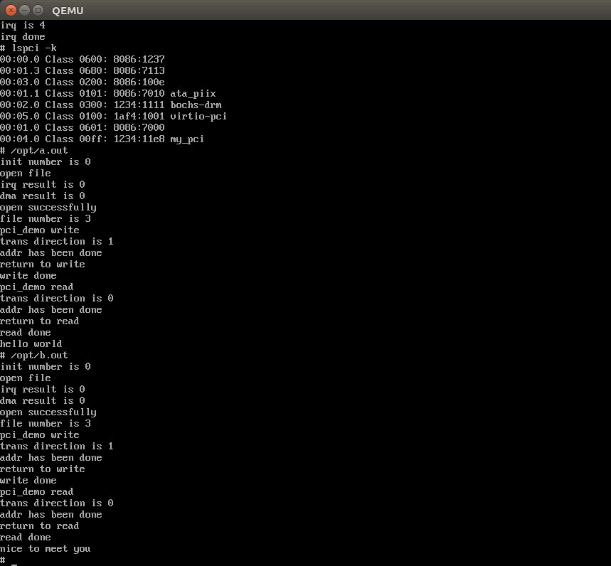

<h1 style="text-align:center">Linux实验报告:PCI驱动编写</h1>
<div class="auther" style="text-align:center">杨庆龙</div>
<div class="date" style="text-align:center">2017.8.8</div>

## 实验环境
Ubuntu17.04(Linux-4.10.0-19-generic)
## 实验目的
注册适用于edu设备的驱动，注册edu设备的IRQ，并使用edu设备的DMA功能。进而深化对Linux系统的工作方式的理解。

## 实验原理
### 注册
在linux/pci.h中定义了PCI设备的驱动程序的结构体"pci_driver"
```C
struct pci_driver {
    struct list_head node;
    char *name;
    const struct pci_device_id *id_table;
    int  (*probe)  (struct pci_dev *dev, const struct pci_device_id *id);
    void (*remove) (struct pci_dev *dev);
    int  (*save_state) (struct pci_dev *dev, u32 state);
    int  (*suspend)(struct pci_dev *dev, u32 state);
    int  (*resume) (struct pci_dev *dev);
    int  (*enable_wake) (struct pci_dev *dev, u32 state, int enable);
}
```
其中，最重要的是用于识别设备用的id_table,用于检测设备的函数probe，以及用于卸载设备的函数remove。编写这三个部分是重点。
### IRQ
edu设备具有中断功能，但具体使用的是哪根中断线，还需要具体的探测。从edu.txt文件中了解到，可以在0x
### DMA
edu设备具有DMA功能。只需操作相应的寄存器，就可以高效地实现设备到系统的数据传递。


## 实验内容
### id_table
id_table是结构体pci_device_id的指针，因此，我们需要定义一个静态的pci_device_id用于指明驱动所对应的设备id。该结构体的定义如下，
```
struct pci_device_id {
    __u32 vendor, device;/* Vendor and device ID or PCI_ANY_ID*/
    __u32 subvendor, subdevice;/* Subsystem ID's or PCI_ANY_ID */
    __u32 class, class_mask;/* (class,subclass,prog-if) triplet */
    kernel_ulong_t driver_data;/* Data private to the driver */
};
```
因为这里只会有一个edu设备，所以只指定vendor和device，确定这是否是edu设备，其他都设置为默认。又查阅edu.txt文件得到，edu设备的设备编号为0x123:0x11e8，因此代码如下
```
static struct pci_device_id my_pci_id {
    {0x1234,0x11e8,PCI_ANY_ID,PCI_ANY_ID,0,0,MY_PCI},
    {0,}
}

```

### probe
在probe函数中，我们最先读取配置空间的寄存器，得到设备的基地址等参数，再进行dev的创建，class的创建，chardev的注册，最后向内核申请内存，作为驱动运行时的buffer。主要用的函数如下
```C
  static inline int pci_read_config_dword(const struct pci_dev *dev,int where, u32 *val)//用于从配置空间读取信息
  static __always_inline void *kmalloc(size_t size, gfp_t flags)//用于向内核申请一块大小为size的内存
  int alloc_chrdev_region(dev_t *dev, unsigned baseminor, unsigned count, const char *name)
  //用于动态注册一个子设备
  class_create(owner, name)//这是一个用于创建class的宏
  void cdev_init(struct vdev*cdev, const struct file_operations *fops)
  //用于初始化字符设备
  int cdev_add(struct cdev*p, dev_t dev, usnsigned count)//用于添加一个字符设备
```

### remove
在remove函数中，除了将设备删除并注销子设备外，最主要的，就是调用了dev_clean函数。该函数的作用为依据一个名为cleanflag的int类型全局变量的数值，依次释放资源。相对应地，这需要在probe函数中，每申请一次资源，就让cleanflag增加1。个人更喜欢这种这种调用函数释放资源的方式，而不是使用goto语句，因为goto语句需要用不同的标识去定位，而这种调用函数的释放方式就只用记住在申请完资源后让cleanflag自加，再在dev_clean函数中增加一行释放资源的语句即可。

## IRQ
IRQ主要用于PCI设备的中断相关的操作，但中断号与设备的物理安装有关，这就涉及到IRQ号的探测。
### 探测方法
此处使用的是将反馈函数遍历地绑定到可能的IRQ中断号上，再操作寄存器，让设备发出中断。若我们绑定了正确的中断号，则相应的反馈函数就会被调用，改变一个全局变量的值，我们也就知道相应的中断号了。
#### 关联中断号和函数
读了一些相关的教程后，考虑使用共享的方式申请IRQ。这里中断函数的作用只是更改一个全局变量，所以其内容如下。
```C
	irqreturn_t probeirq(int irq, void * dev_id) {
	   global_para = irq;
	   return 0;
  }
```
#### 操作寄存器
从edu设备的配置空间可以得到，其物理基地址为0xfea00000，又从edu.txt中得到，其内存空间有1M大小，因此，其物理地址为0xfea00000到0xfeafffff。知道了物理地址后，使用ioremap函数，将物理地址映射到虚拟地址，得到相应的虚拟地址偏移量，cpu就能够操作相应的寄存器。
```C
  base = (void __iomem*)ioremap(0xfea00000,0x100000);
```
从edu.txt中可以知道，我们可以在0x60和0x64的地方控制edu设备的中断。操作方法如下
```C
writeb(0xff,0x60+base);
writeb(0xff,0x64+base);
```
这样就能够让设备发起中断，进行IRQ号的探测。

## DMA
DMA是CPU向设备的控制寄存器写入数据的源地址和目标地址，使用DMA控制器进行数据传输，避免CPU浪费时间进行地址的转换等工作，提高了系统的工作效率。
### 地址转换
在DMA中，需要将内存的地址转为总线地址才能进行相应的操作，而且，在DMA对内存进行操作时，CPU不能访问被操作的内存区域。将内存的虚拟地址转为总线地址的语句如下
```C
dma_addr_t bus_addr = pci_map_single(pdev,buffer,count,direction);//因为此处对DMA并没有其他特殊要求，所以使用的是pci_map_single函数
```
### 操作寄存器
从edu.txt中了解到，操作edu设备的DMA功能主要需要操作以下几个寄存器
<ul>
<li>0x80:源地址寄存器</li>
<li>0x88:目标地址寄存器</li>
<li>0x90:数据长度寄存器</li>
<li>0x98:控制寄存器</li>
</ul>
## 实验结果
没有加载驱动时，使用lspci命令可以看到，设备列表中有1234:11e8即edu设备的存在，但是并没有相关的驱动被关联到相应的设备上。

加载驱动后，再使用lspci命令可以看到驱动被关联到设备上。同时，还可以看到在probe过程中读取到的配置空间的内容。

调用测试程序a.out，可以看到输出结果依然为"hello world"即说明DMA功能在正常工作

调用测试程序b.out，可以看到输出结果依然为"nice to meet you",说明DMA功能正常工作，实验完成。


## 遇到的问题
### IRQ探测
在第二次加载驱动时，不能探测到edu设备的IRQ号，认为是IRQ处理位没有被释放，导致IRQ无响应。在调用中断函数后，设置acknowledge irq寄存器为0xff即可。
