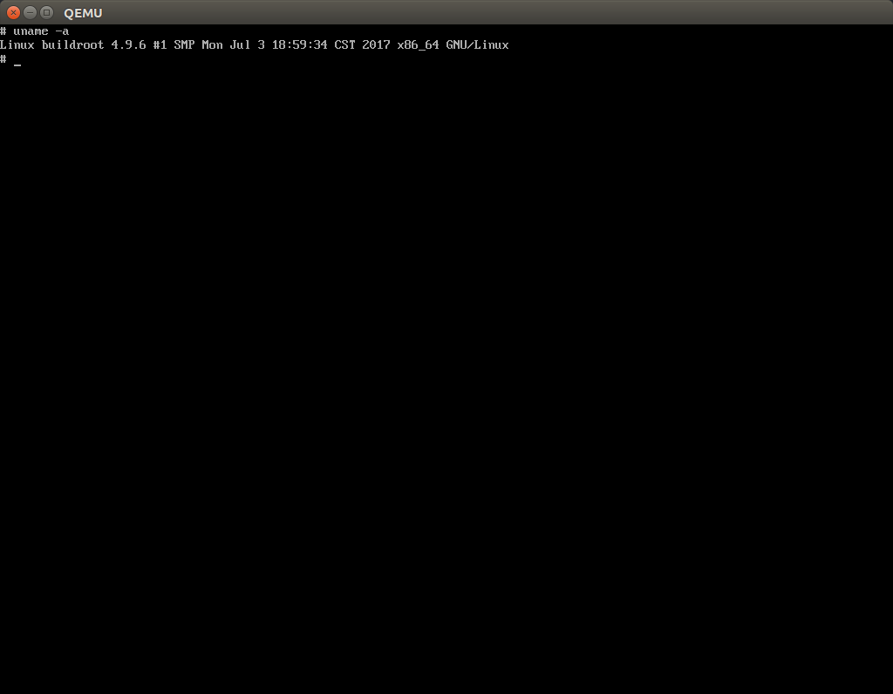

<h1 style="text-align:center"> Linux实验报告：qemu与buildroot使用
</h1>
<div class="auther" style="text-align:center"> 杨庆龙 </div>
<div class="date" style="text-align:center">2017.8.8</div>

## 系统环境
OS:Linux-4.10.0-19-generic
## 操作过程
### 安装qemu与buildroot
#### qemu安装
```
sudo apt-get install qemu
```
#### buildroot依赖软件安装
buildroot需要用到不少软件，所以需要安装的东西还是不少的。
```shell
sudo apt-get install bison
sudo apt-get install flex
sudo apt-get install texinfo
sudo apt-get install hgsubversion
sudo apt-get install whois
sudo apt-get install autoconf
sudo apt-get install wget
sudo apt-get install patch
sudo apt-get install zlib
sudo apt-get install dos2unix
sudo apt-get install gawk
```
#### buildroot本体安装
到链接<a href="https://buildroot.org/download.html">https://buildroot.org/download.html</a>处下载buildroot的安装包，此处选择的是"buildroot-2017.05.2.tar.gz"。之后使用命令
```
tar -xvzf buildroot-2017.05.2.tar.gz
```
解压得到buildroot本体。
### 内核及文件系统的生成
1. 在buildroot目录下，使用
```
make list-defconfigs"
```
命令，列出buildroot已经配置好的样例列表。
2. 在第一步中列出的样例列表中找到qemu_x86_64_defconfig，然后再使用
```shell
make qemu_x86_64_defconfig
```
命令，将qemu_x86_64_defconfig作为buildroot的配置文件。
3. 使用
```
make menuconfig
```
命令，编译出选项菜单的图形界面，在"System configuration->Root password"中配置上我们所需要的密码,若此项为空，则无需密码。
4. 使用
```
make -j8
```
编译内核以及相应的文件系统，此处使用-j8选项使用8线程编译提高编译速度
5. 生成好的文件在"output/images/"目录下，其中bzImage为内核文件，rootfs.ext2为ext2格式的文件系统
### 加载内核和文件系统
使用
```
qemu-system-x86_64
```
命令加载系统，需要用到的选项如下
<ul>
<li>-kernel 内核位置 此处为output/images/bzImage</li>
<li>-drive 驱动器位置 此处即为我们的ext2文件系统，还需要参数format说明文件系统格式，if说明访问媒体的层次</li>
<li>-M 加载内核的运行平台 此处为pc</li>
<li>-m 平台的内存大小，单位为M 此处为5120</li>
<li>-smp 平台的核心数目 此处为4</li>
<li>-append 一些附加的命令，此处将/dev/vda挂载为root</li>
</ul>
综上，使用qemu加载Linux系统的完整命令为
```
qemu-system-x86_64 -m 5120 -smp 4 -M pc -kernel output/images/bzImage -drive file=output/images/rootfs.ext2,if=virtio,format=raw -append root=/dev/vda
```

### 加载系统后查看版本号
输入密码，进入系统，使用
```
uname -a
```
命令查看运行系统的版本号为"4.9.6"，完成基本的Linux系统编译与运行。
截图如下 

## 遇到的问题
在buildroot目录下，使用"make menuconfig"命令，因缺少库"ncurses"而终止。使用
```
sudo apt-get install libncurses5-dev
```
命令安装相应的库即可解决问题。
